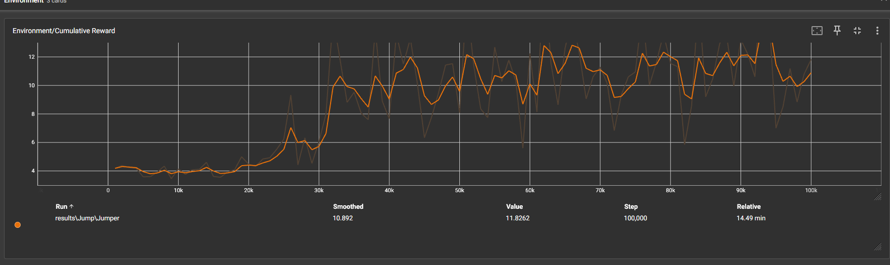

#Team
Student 1: Santi
Studdent 2: Bas 

## Set-up

Een taak waarbij een agent moet springen over balken

## Doel:

De agent moet over zoveel mogelijk balken springen zonder er een te raken

## Agents:

The environment heeft een agent.

## Agent beloning system:

- -0.05 bij elke jump
- -1 wanneer de agent een log hit
- +0.5 voor elke log die gedelete word (betekent dat de agent erover is gesprongen)
- +0.01 voor elke frame dat de agent nog niet springt

## Behavior Parameters:

- Vector Observation space:
- - Een variable die de huidige toestand weergeeft.
- Actions:
- - 2 discrete actions met elk 1 actie.
- Visual Observations: RayCast
- Float Properties: None

## Training

In de trainresultaten zie je dat de grafiek een duidelijk leercurve laat zien. De eerste 20 duizend stappen bleef de beloning redelijk laag en stabiel. Tussen de 20 and 30 duizend stappen zien we een hele snelle toename in de beloningen van ongeveer 4 naar 12. Deze versnelling komt overheen met wanneer de agent leerde om over de logs te springen.

Hierna zien we niet zo een groot verschil meer in de toename. Voor de rest van de 70 duizend stappen schommeld het een beetje tussen de 10 en 12.

Link video: https://ap.cloud.panopto.eu/Panopto/Pages/Sessions/List.aspx#folderQuery=%22vr%20%22&folderID=%223eaa47ce-67fa-4080-bce6-b11b0071a3b2%22
