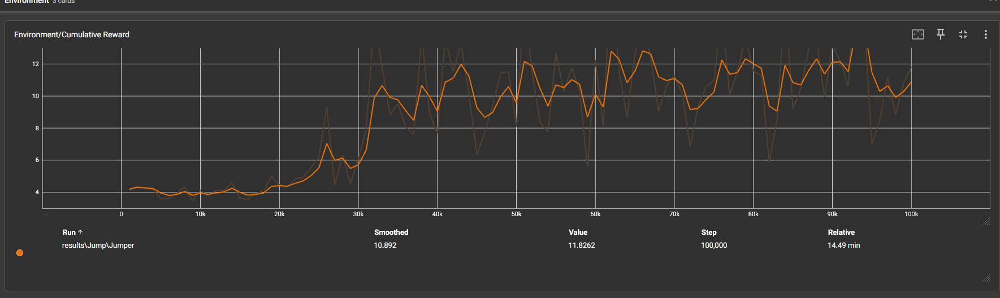

# Verslag Jumper oefening

## Set-up
### Map
Hieronder is onze scène weergegeven. Deze bevat een onzichtbare muur, een vloer, een agent en een empty object genaamd Spawner. In de verdere documentatie worden deze onderdelen in meer detail besproken.


### Vloer
De vloer is een Empty GameObject met een mesh (bv. plane of cube) waaraan een MeshCollider is toegevoegd en dat de tag "Ground" krijgt, zodat de agent dit oppervlak kan waarnemen via raycasts. De vloer heeft ook een mesh collider nodig.


### Agent
De agent is een cube met een Rigidbody, een Ray Perception Sensor 3D (de instellingen zijn terug te vinden in de screenshot), een Decision Requester en een script (opgenomen in het project en later in dit verslag verder toegelicht).


### Wall 
De wall is een Empty GameObject met een BoxCollider en wordt gebruikt als een soort "destroyer" voor objecten.


### Spawner
Dit is een Empty GameObject dat gebruikt wordt als spawnlocatie voor de obstacles en verder geen componenten bevat.


### Target (obstacle)
Dit is een cube die vervormd werd tot een balk. Het object heeft een BoxCollider, een Mover script en een Rigidbody.


###  Scripts
#### JumperScript
```csharp
public float jumpForce = 2f;
public GameObject Target;
public Transform Spawner;
private List<GameObject> spawnedObjects = new List<GameObject>(); 
public float minTime = 5f;
public float maxTime = 10f;
private float timer;
private float spawnTime;

private bool isGrounded;
private bool jumpRequested = false;
```
--> Hier worden instellingen en states bijgehouden: springkracht, spawn-instellingen voor obstakels, een lijst van gespawnede objecten en flags zoals isGrounded.


```csharp
public override void Initialize()
{
    Rigidbody rb = GetComponent<Rigidbody>();
    if (rb != null)
    {
        rb.constraints = RigidbodyConstraints.FreezeRotationX | RigidbodyConstraints.FreezeRotationZ | RigidbodyConstraints.FreezeRotationY;
    }
}

```
--> Bij het starten krijgt de agent een Rigidbody met rotatie-beperkingen, zodat hij niet omvalt.


```csharp
public override void OnEpisodeBegin()
{
    DestroyAllInstances();
    this.transform.localPosition = new Vector3(0, 0.5f, -7);
    GetComponent<Rigidbody>().linearVelocity = new Vector3(0, 0, 0);
    isGrounded = true;
}
```
--> Bij elke nieuwe episode: alle oude obstakels weg, de agent terugzetten naar startpositie en snelheid resetten.


```csharp
public void SpawnObject()
{
    GameObject obj = Instantiate(Target, Spawner.position, Quaternion.identity);
    Mover mover = obj.GetComponent<Mover>();
    if (mover != null)
    {
        mover.jumper = this;
    }
    spawnedObjects.Add(obj);
}
```
--> Hier wordt een obstakel (Target prefab) gespawned op de spawner. Het Mover-script wordt gekoppeld aan de agent.


```csharp
void ResetTimer()
{
    spawnTime = Random.Range(minTime, maxTime);
    timer = 0;
}

void Update()
{
    timer += Time.deltaTime;
    if (timer >= spawnTime)
    {
        SpawnObject();
        ResetTimer();
    }
    if (Input.GetKeyDown(KeyCode.Space))
    {
        jumpRequested = true;
    }
}

```
--> Er wordt elke episode na een willekeurige tijd een obstakel gespawned. Ook wordt de jump input voor Heuristic mode hier opgevangen.


```csharp
public override void OnActionReceived(ActionBuffers actionBuffers)
{
    if (isGrounded && actionBuffers.DiscreteActions[0] == 1)
    {
        GetComponent<Rigidbody>().AddForce(new Vector3(0, jumpForce, 0), ForceMode.VelocityChange);
        AddReward(-0.05f);
        isGrounded = false;
    }
    else
    {
        AddReward(0.01f);
    }
}
```
-->
- Acties: 0 = niets doen, 1 = springen.

- Springen → kleine straf (-0.05).

- Niets doen → kleine beloning (+0.01).


```csharp
private void OnCollisionEnter(Collision collision)
{
    if (collision.gameObject.CompareTag("ground"))
    {
        isGrounded = true;
    }

    if (collision.gameObject.CompareTag("target"))
    {
        Debug.Log("Collision!!!");
        AddReward(-1f);
        EndEpisode();
    }
}
```
-->
- Agent wordt weer grounded bij botsing met de vloer.

- Bij botsing met obstakel → -1 reward en episode eindigt.

### Mover script


```csharp
public Vector3 direction = Vector3.back;
public float speed;
public Jumper jumper;
```
-->
- direction: richting waarin het obstakel beweegt (standaard naar achteren).

- speed: snelheid van het obstakel.

- jumper: referentie naar de agent, zodat beloningen kunnen worden toegekend.


```csharp
void Start()
{
    speed = Random.Range(4f, 6f);
}
```
--> Bij het spawnen krijgt elk obstakel een willekeurige snelheid tussen 4 en 6.


```csharp
void Update()
{
    transform.Translate(direction.normalized * speed * Time.deltaTime);
}
```
--> Het obstakel beweegt constant in de ingestelde richting, met de gekozen snelheid.


```csharp
void OnCollisionEnter(Collision collision)
{
    if (collision.gameObject.CompareTag("wall"))
    {
        Debug.Log(gameObject.name + " collided with a wall!");
        if (jumper != null)
        {
            jumper.RewardForWallCollision();
        }
        else
        {
            Debug.LogError("Jumper reference not set in Mover.");
        }
        Destroy(gameObject);
    }
}
```
--> 
- Als het obstakel een muur raakt:

- De agent krijgt een positieve beloning via RewardForWallCollision().

- Het obstakel wordt vernietigd (Destroy).

## Doel:

De agent moet over zoveel mogelijk balken springen zonder er een te raken

## Training



In de trainresultaten zie je dat de grafiek een duidelijk leercurve laat zien. De eerste 20 duizend stappen bleef de beloning redelijk laag en stabiel. Tussen de 20 and 30 duizend stappen zien we een hele snelle toename in de beloningen van ongeveer 4 naar 12. Deze versnelling komt overheen met wanneer de agent leerde om over de logs te springen.

Hierna zien we niet zo een groot verschil meer in de toename. Voor de rest van de 70 duizend stappen schommeld het een beetje tussen de 10 en 12.

Link video: https://ap.cloud.panopto.eu/Panopto/Pages/Viewer.aspx?id=eca73973-c6f6-4b81-b407-b346010dfb23
